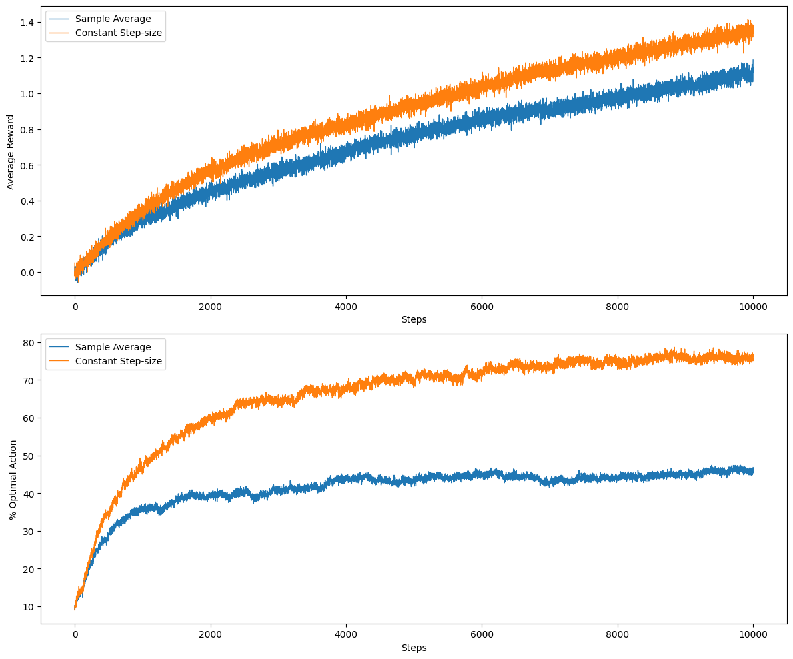
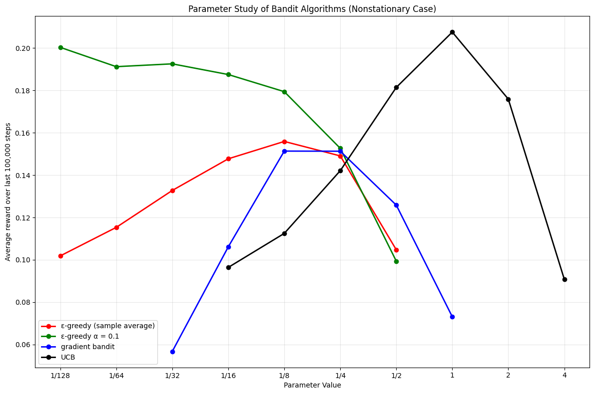

### Solution 2.1

$$
P(optimal) = (1-\epsilon) + \frac{\epsilon}{n} = 0.5 + 0.5 * \frac{1}{2} = 0.5 + 0.25 = 0.75
$$

 

### Solution 2.2

| Time Step | Action Taken | Reward | Q(1) | Q(2) | Q(3) | Q(4) | Greedy Action(s) |
| :-------: | :----------: | :----: | :--: | :--: | :--: | :--: | :--------------: |
|     0     |      -       |   -    |  0   |  0   |  0   |  0   |        -         |
|     1     |      1       |   -1   |  -1  |  0   |  0   |  0   |    1, 2, 3, 4    |
|     2     |      2       |   1    |  -1  |  1   |  0   |  0   |     2, 3, 4      |
|     3     |      2       |   -2   |  -1  | -1/2 |  0   |  0   |        2         |
|     4     |      2       |   2    |  -1  | 1/3  |  0   |  0   |       3, 4       |
|     5     |      3       |   0    |  -1  | 1/3  |  0   |  0   |        2         |

 

At time steps 4 and 5, a non-greedy action was selected. Therefore, those selections were definitely random.

At time steps 1, 2 and 3, the action selected could've been greedy or random. Therefore, the actions are possibly random.

 

### Solution 2.3

For $\epsilon = 0.1$,

$$ P(optimal) = (1-\epsilon) + \frac{\epsilon}{n} = 0.9 + \frac{0.1}{10} = 0.91 $$

For $\epsilon = 0.01$,

$$ P(optimal) = (1-\epsilon) + \frac{\epsilon}{n} = 0.99 + \frac{0.01}{10} = 0.991 $$

Therefore, in the limit, the probability of selecting the optimal action is higher if we select $\epsilon = 0.01$ even though in the shorter term $\epsilon = 0.1$ starts finding the optimal action sooner.

And since the expected reward is given by

$$
\mathbb{E}[R] \;=\; P(\text{optimal}) \cdot \mu^* \;+\; \big(1 - P(\text{optimal})\big) \cdot \bar{\mu}_{\text{other}}
$$

The expected reward will be higher for the action that gets selected more often in the longer run. Therefore, the expected reward for $\epsilon = 0.01$ will be higher.

 

### Solution 2.4

$$
Q_{n+1} = Q_n + \alpha_n (R_n - Q_n)
= (1 - \alpha_n) Q_n + \alpha_n R_n
$$

 

We can expand this recursively to

$$
Q_{n+1} = (1 - \alpha_n)(1 - \alpha_{n-1}) Q_{n-1}
          + (1 - \alpha_n)\alpha_{n-1} R_{n-1}
          + \alpha_n R_n.
$$

By continuing the expansion, we get the general form:

$$
Q_{n+1} = \Bigg( \prod_{j=1}^n (1 - \alpha_j) \Bigg) Q_1
        + \sum_{i=1}^n \Bigg( \alpha_i \prod_{j=i+1}^n (1 - \alpha_j) \Bigg) R_i
$$

So the weighting on each prior reward $R_i$ is:

$$
\alpha_i \prod_{j=i+1}^n (1 - \alpha_j)
$$

 

### Solution 2.5

As we can see from the results above, the constant step-size agent performs better than the sample average agent when the bandit is non-stationary.

 

### Solution 2.6

The optimistic initial values force the agent to explore more in the start. The agent cycles through all possible actions, most of which aren't optimal actions.

During this exploration, we sometimes discover optimal actions leading to a big spike. However, this is usually followed by suboptimal actions which is why we see such oscillatory behavior.

 

### Solution 2.7

In Solution 2.4, the weight on $Q_1$ stays non-zero, which is the cause of the bias. We need to show that by using $\beta_n$ instead of a constant step size, the weight on $Q_1$ is zero.

$$
Q_{n+1} = Q_n + \beta_n \big(R_n - Q_n\big)
$$

$$
= (1-\beta_n) Q_n + \beta_n R_n
$$

We can expand this recursively to

$$
Q_{n+1} = (1 - \beta_n)(1 - \beta_{n-1}) Q_{n-1}
          + (1 - \beta_n)\beta_{n-1} R_{n-1}
          + \beta_n R_n.
$$

By continuing the expansion, we get the general form:

$$
Q_{n+1} = \Bigg( \prod_{j=1}^n (1 - \beta_j) \Bigg) Q_1
        + \sum_{i=1}^n \Bigg( \beta_i \prod_{j=i+1}^n (1 - \beta_j) \Bigg) R_i
$$

Also, since

$$
\bar{o}_n = \bar{o}_{n-1} + \alpha \bigl(1 - \bar{o}_{n-1}\bigr),
\quad \bar{o}_0 = 0.
$$

With some simple derivation, this can be rewritten as

$$
\bar{o}_n = 1 - (1 - \alpha)^n
$$

So,

$$
\beta_n = \frac{\alpha}{1 - (1 - \alpha)^n}
$$

And,

$$ 1 - \beta_1 = 1 - \frac{\alpha}{1 - (1 - \alpha)} = 1 - 1 = 0 $$

Since the weight on $ Q_1 $ includes this term, it turns out to be zero and $Q_1$ is thus cancelled out and we are left with:

$$
Q_{n+1} = \sum_{i=1}^n \Bigg( \beta_i \prod_{j=i+1}^n (1 - \beta_j) \Bigg) R_i
$$

 

### Solution 2.8

For the first 10 timesteps, the UCB algorithm samples each action once.

After this, it samples according to

$$
A_t = \arg\max_a \left[ \hat{q}_t(a) + c \sqrt{\frac{\ln t}{N_t(a)}} \right]
$$

For the 11th timestep, the bonus term is identical for all actions $ c \sqrt{\frac{\ln 11}{1}} $ and therefore the single-sample greedy action is selected. This action happened to return a high reward leading to a jump.

However, at the next time step, $N(a)$ increased to $2$ for this action, whereas it stayed at $1$ for all the other actions. This made the algorithm re-explore many of those under-sampled arms.

This short-run extra exploration lowers the subsequent average reward, so the curve drops after the spike and then recovers as estimates improve.

A larger $c$ leads to more exploration. With $c = 1$, the exploration is weaker, so the post-spike dip is smaller and the spike is less prominent.

 

### Solution 2.9

For two actions, we can write the softmax function as

$$
\pi_t(1)=\frac{e^{H_1}}{e^{H_1}+e^{H_2}}
$$

$$
=\frac{e^{H_1}}{e^{H_1}+e^{H_2}} \cdot \frac{e^{H_1}}{e^{H_1}}
=\frac{1}{1+e^{H_2 - H_1}}
= \sigma\big(H_t(1) - H_t(2)\big)
$$

Similarly,

$$
\pi_t(2)=\frac{e^{H_2}}{e^{H_1}+e^{H_2}} = \frac{1}{1+e^{H_1 - H_2}} = \sigma\big(H_t(2) - H_t(1)\big)
$$

 

### Solution 2.10

In the general case,

$$
\mathbb{E}[R \mid a_1] = 0.5 \cdot 10 + 0.5 \cdot 90 = 50
$$

$$
\mathbb{E}[R \mid a_2] = 0.5 \cdot 20 + 0.5 \cdot 80 = 50
$$

Therefore, no matter what action we select, our expected reward is 50.

However, if we are told beforehand whether it is a case A or a case B, we can act greedily per case.

- Case A $(a_1=10, a_2=20) \;\Rightarrow\; \text{choose } a_2$
- Case B $(a_1=90, a_2=80) \;\Rightarrow\; \text{choose } a_1$

 

And our expected reward is

$$
\mathbb{E}[R] = 0.5 \cdot 20 + 0.5 \cdot 90 = 55
$$

 

### Solution 2.11

