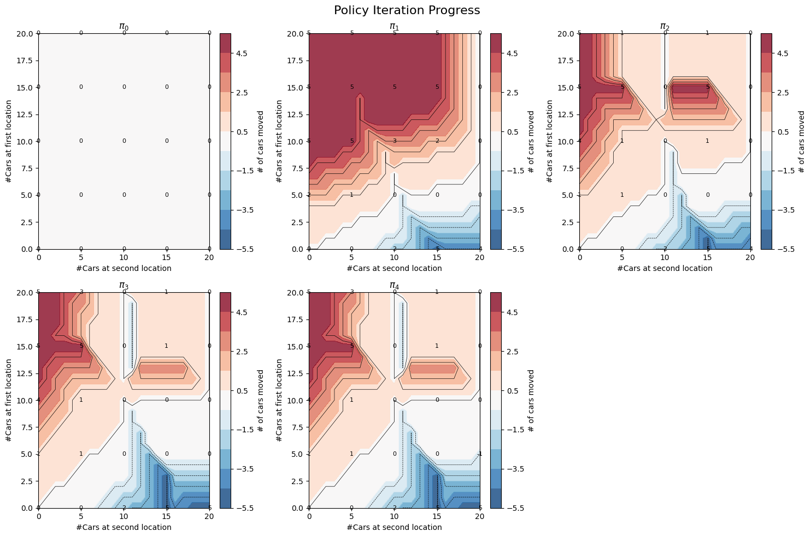
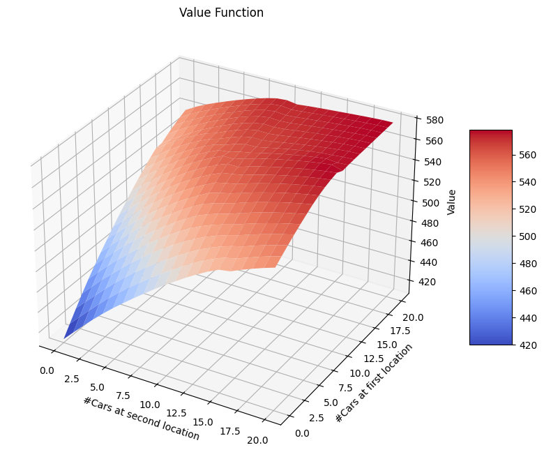
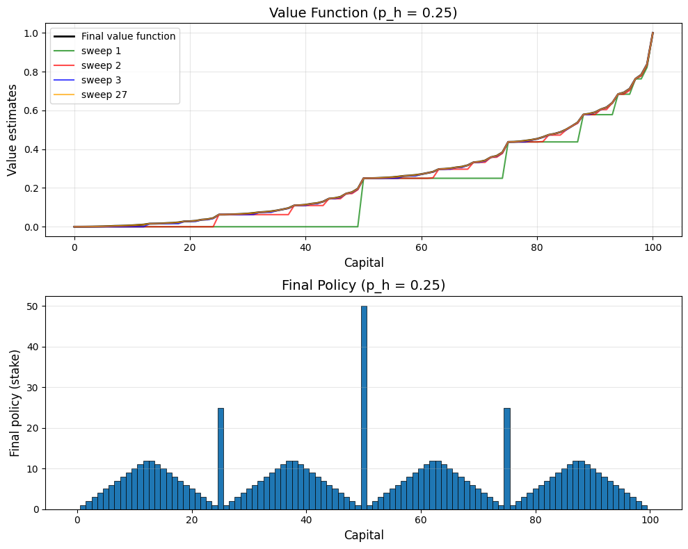
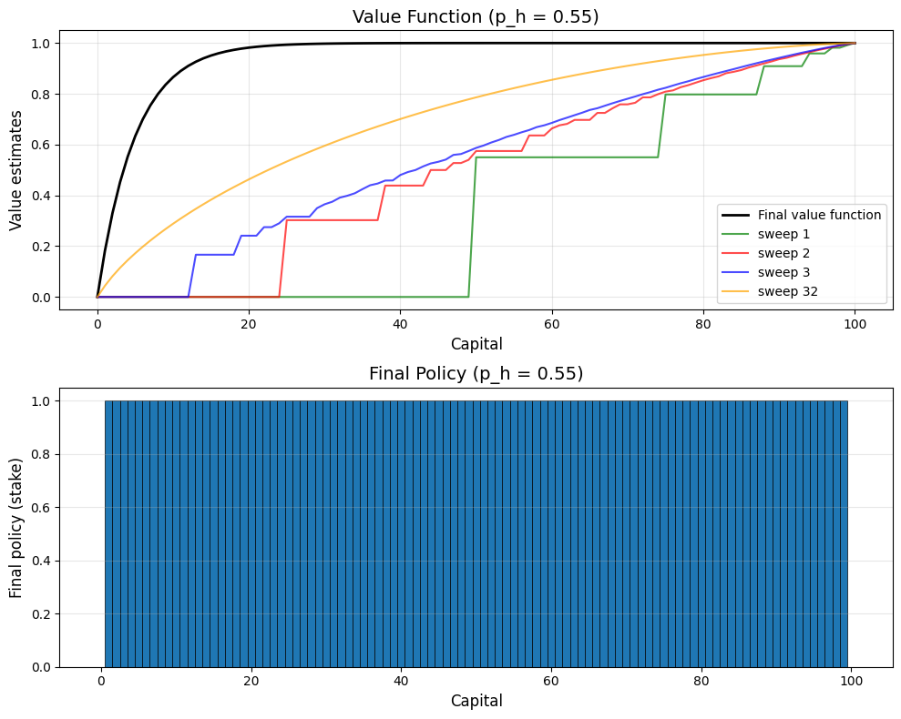

### Solution 4.1

$$
q_\pi(s,a) = \sum_{s',r} p(s',r \mid s,a) \Big[\, r + \gamma v_\pi(s') \Big]
$$

Since the transition probabilities are deterministic, we can simplify the equation to:

$$
q_\pi(s,a) = r + \gamma v_\pi(s')
$$

$$
q_\pi(11, down) = -1 + 1(0) = -1
$$

$$
q_\pi(7, down) = -1 + 1(-14) = -15
$$

 

### Solution 4.2

Since the transition probabilities are deterministic and $\gamma = 1$, we can write the state values as:

$$
v_\pi(s) = \sum_{a} \pi(a \mid s) \Big[ r + v_\pi(s') \Big]
$$

For the first scenario, where the $\text{up}$ action at state $15$ leads to state $13$, we have:

$$
v_\pi(15) = -1 + 0.25 \Big[ v_\pi(12) + v_\pi(13) + v_\pi(14) + v_\pi(15)\Big]
$$

$$
v_\pi(15) = -1 + 0.25 \Big(v_\pi(15) -56\Big)
$$

$$
0.75 \cdot v_\pi(15) = -15
$$

$$
v_\pi(15) = -20
$$

For the second scenario, where the $\text{down}$ action at state $13$ also leads to state $15$, we have:

$$
v_\pi(15) = -1 + 0.25 \Big[ v_\pi(12) + v_\pi(13) + v_\pi(14) + v_\pi(15)\Big]
$$

$$
v_\pi(15) = -1 + 0.25 \Big[ v_\pi(13) + v_\pi(15) - 36 \Big]
$$

$$
0.75 \cdot v_\pi(15) - 0.25 \cdot v_\pi(13) = -10 \tag{1}
$$

$$
v_\pi(13) = -1 + 0.25 \Big[ v_\pi(9) + v_\pi(12) + v_\pi(14) + v_\pi(15)\Big]
$$

$$
v_\pi(13) = -1 + 0.25 \Big[ v_\pi(15) -56 \Big]
$$

$$
v_\pi(13) - 0.25 \cdot v_\pi(15) = -15 \tag{2}
$$

Solving the two equations simultaneously, we get:

$$
v_\pi(15) = -20
$$

 

### Solution 4.3

The analog of (4.3) is:

$$
q_{\pi}(s,a) = \mathbb{E}_{\pi}\!\left[ R_{t+1} + \gamma \, q_{\pi}(S_{t+1},A_{t+1}) \;\middle|\; S_t = s,\, A_t = a \right]
$$

The analog of (4.4) is:

$$
q_{\pi}(s,a) = \sum_{s',r} p(s',r \mid s,a) \Big[ r + \gamma \sum_{a'} \pi(a' \mid s') \, q_{\pi}(s',a') \Big]
$$

The analog of (4.5) is:

$$
q_{k+1}(s,a) = \sum_{s',r} p(s',r \mid s,a) \Big[ r + \gamma \sum_{a'} \pi(a' \mid s') \, q_{k}(s',a') \Big]
$$

 

### Solution 4.4

To fix this bug, we should update the policy improvement algorithm to only update the policy if there's a strict improvement in the value function.

$\text{policy-stable} \leftarrow \text{true}$

$\text{For each } s \in \mathcal{S}$:

$\quad \text{old-action} \leftarrow \pi(s)$

$\quad \text{For each } a \in \mathcal{A}$:

$\quad \quad Q(s, a) \leftarrow \sum_{s',r} p(s', r \mid s, a) \Big[ r + \gamma V(s') \Big]$

$\quad \text{best-action} \leftarrow \argmax_a Q(s, a)$

$\quad \text{if } Q(s, \text{best-action}) > Q(s, \text{old-action}):$

$\quad \quad \pi(s) \leftarrow \text{best-action}$

$\quad \quad \text{policy-stable} \leftarrow \text{false}$

$\text{If policy-stable, then stop and return } V \approx v^* \text{ and } \pi \approx \pi^* \text{; else go to 2}$

 

### Solution 4.5

#### 1. Initialization

$ Q(s,a) \in \mathbb{R}, \quad \pi(s) \in \mathcal{A}(s), \quad \forall s \in \mathcal{S}, a \in \mathcal{A}(s) \quad Q(\text{terminal}, a) = 0 $

#### 2. Policy Evaluation

$\text{Loop:}$

$\quad \Delta \leftarrow 0$

$\quad \text{Loop for each } s \in \mathcal{S}, a \in \mathcal{A}(s):$

$\quad \quad q \leftarrow Q(s, a)$

$\quad \quad Q(s,a) \leftarrow \sum_{s',r} p(s', r \mid s, a) \big[ r + \gamma Q(s', \pi(s')) \big]$

$\quad \quad \Delta \leftarrow \max(\Delta, |Q(s,a) - q|)$

$\text{until } \Delta < \theta$

#### 3. Policy Improvement

$\text{policy-stable} \leftarrow \text{true}$

$\text{For each } s \in \mathcal{S}$:

$\quad \text{old-action} \leftarrow \pi(s)$

$\quad \pi(s) \leftarrow \argmax_a Q(s, a)$

$\quad \text{if } \pi(s) \neq \text{old-action}:$

$\quad \quad \text{policy-stable} \leftarrow \text{false}$

$\text{If policy-stable, then stop and return } Q \approx q^* \text{ and } \pi \approx \pi^* \text{; else go to 2}$

 

### Solution 4.6

#### 3. Policy Improvement

We will replace the deterministic greedy update with an $\epsilon$-soft update.

$$
\pi(a \mid s) =
\begin{cases}
1 - \epsilon + \dfrac{\epsilon}{|\mathcal{A}(s)|}, & \text{if } a = \arg\max_a q(s, a) \\
\dfrac{\epsilon}{|\mathcal{A}(s)|}, & \text{otherwise.}
\end{cases}
$$

Also, we will now check if the policy is stable by comparing the distributions $\pi$ and $\pi'$ rather than just the argmax action.

#### 2. Policy Evaluation

The Bellman expectation update must use $ \pi(a \mid s) $ instead of a single action.

$$
V(s) \leftarrow \sum_a \pi(a \mid s) \sum_{s',r} p(s', r \mid s, a)\bigl[ r + \gamma V(s') \bigr]
$$

#### 3. Policy Improvement

We will initialize $\pi$ as an $\epsilon$-soft policy (e.g. uniform over all actions) and set $V(s) = 0$.

 

### Solution 4.7

Since one free car can move from location 1 to 2, the optimal policy is asymmetric: it often sends cars $1 \rightarrow 2$ and only shifts $2 \rightarrow 1$ when location 1 is short.

Moreover, a $4$ parking surcharge creates sharp boundaries around $10$ cars, so the policy actively avoids holding more than $10$ cars at either site, which produces the visible "notches" in the contour plots.

 

### Solution 4.8

The coin is not fair and the odds are against the gambler. As the number of flips increases, the probability of winning decreases.

When the gambler's capital allows them to reach $100$ exactly with one win (such as at $50$ or $75$), the best strategy is to bet everything - it gives the highest possible chance of winning quickly.

But when the capital is just above or below such points (such as at $51$), betting everything becomes too risky: losing would drop them too close to $0$, where recovery is unlikely. In those cases, smaller bets slightly increase the overall probability of eventually reaching the goal.

 

### Solution 4.9

We can see from the plots that for $p_h = 0.25$, the results are very similar to those for $p_h = 0.4$. In both cases, the odds are against the gambler, leading to large, high-risk bets only when the gambler can reach the goal exactly on a win.

In contrast, when $p_h = 0.55$, the odds are favorable. The gambler adopts smaller, safer bets, using the advantage to make steady progress toward the goal without taking unnecessary risks.

 

### Solution 4.10

$$
q_{k+1}(s, a) = \mathbb{E}\left[ R_{t+1} + \gamma \max_{a'} q_k(S_{t+1}, a') \,\middle|\, S_t = s, A_t = a \right]
$$

$$
= \sum_{s', r} p(s', r \mid s, a) \left[ r + \gamma \max_{a'} q_k(s', a') \right]
$$
