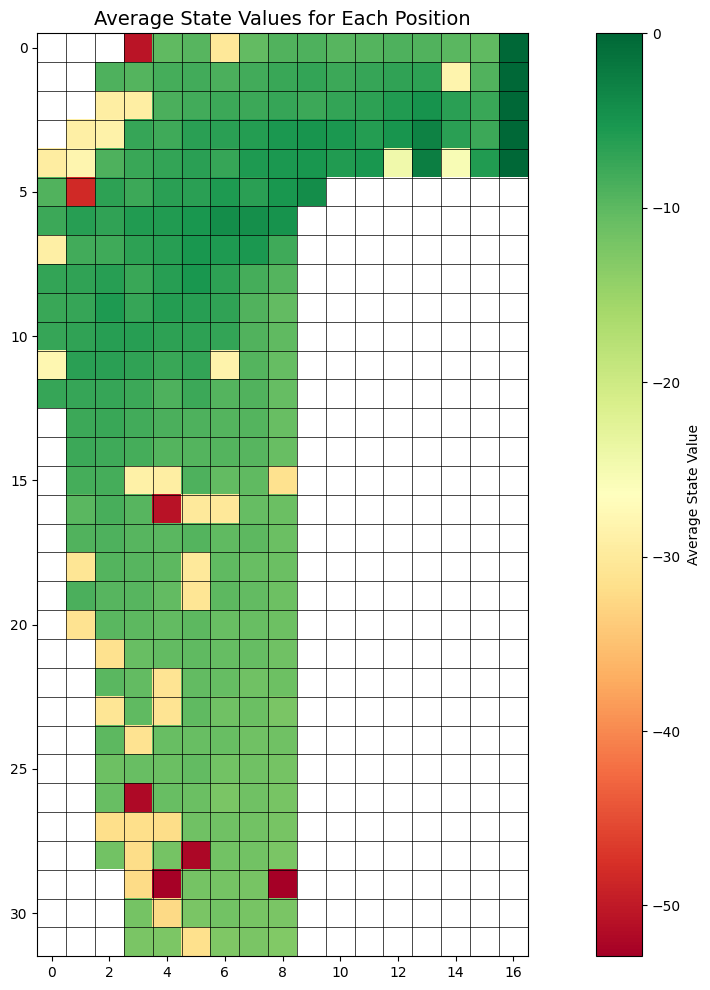
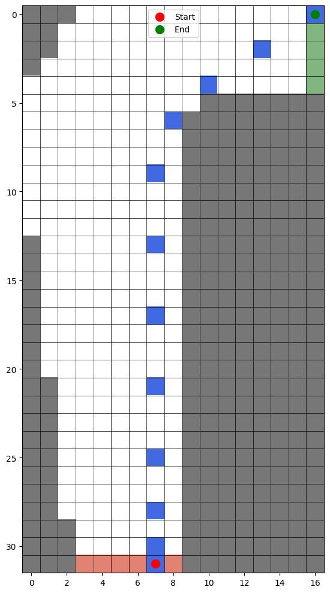
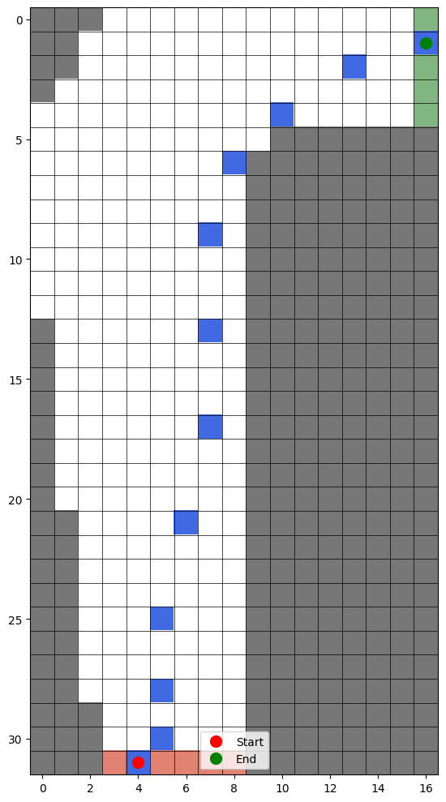
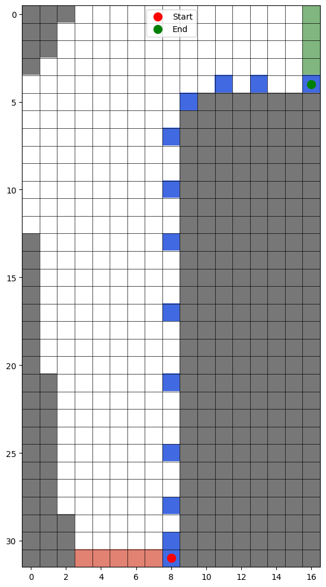
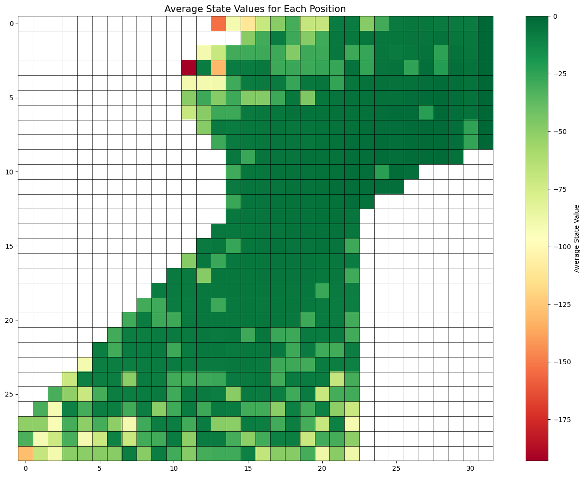
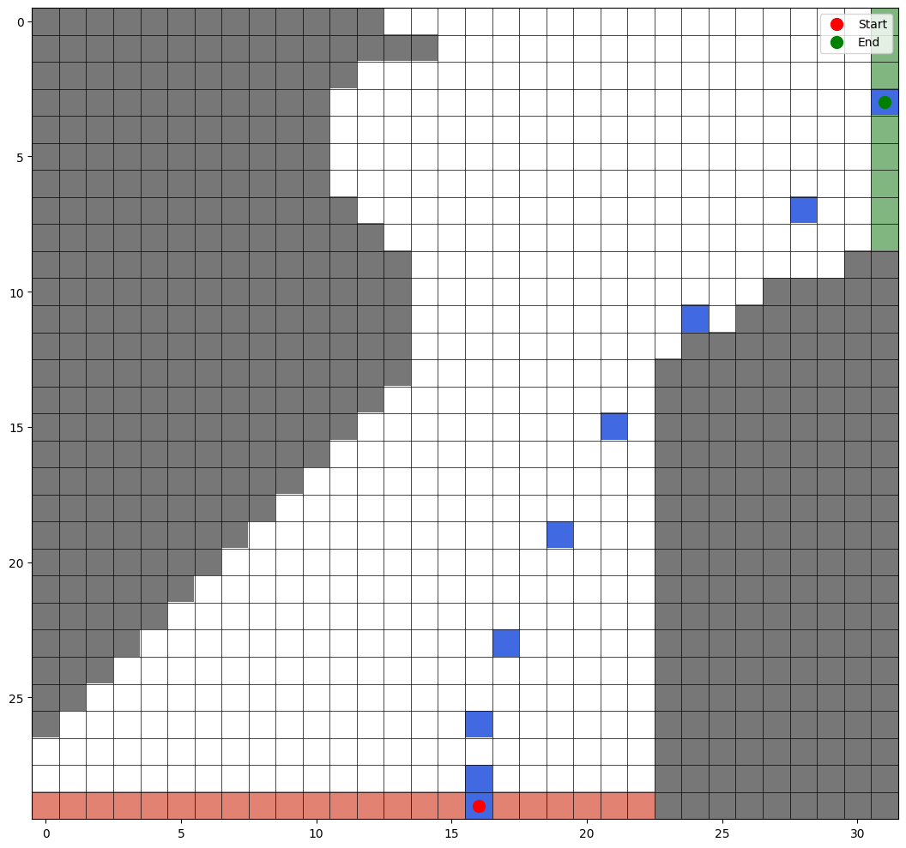
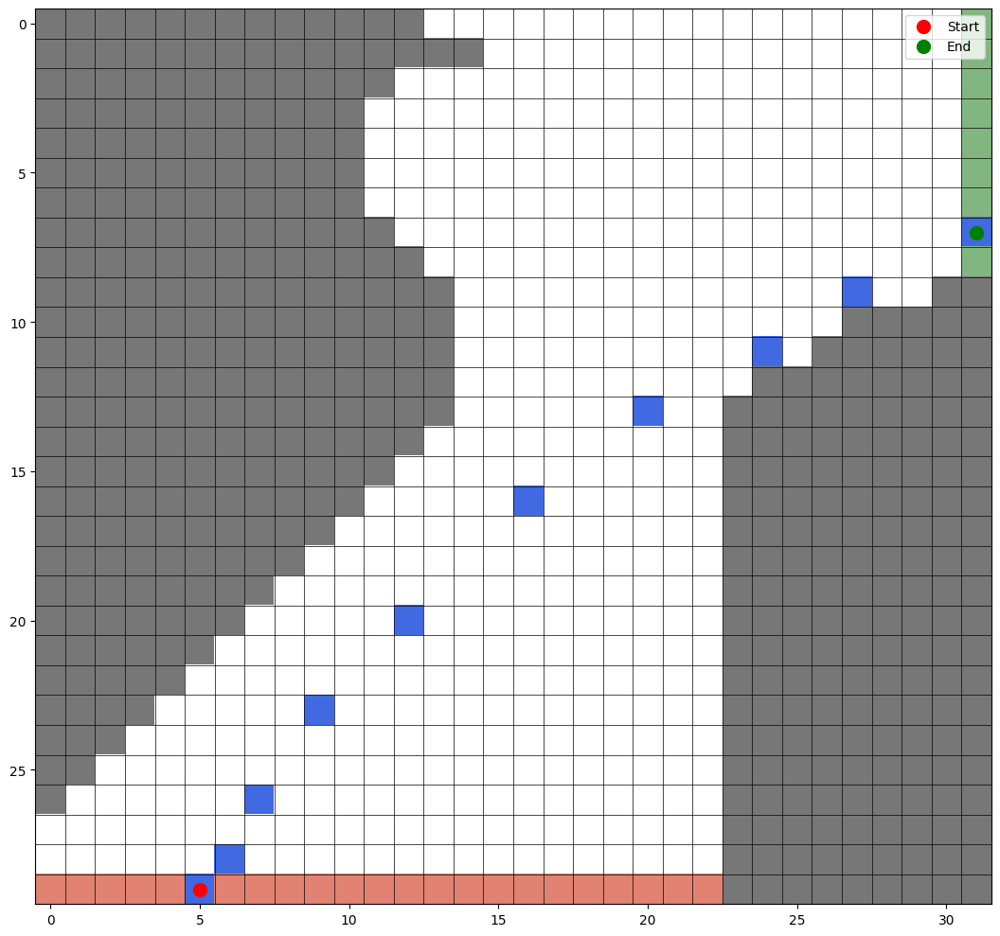
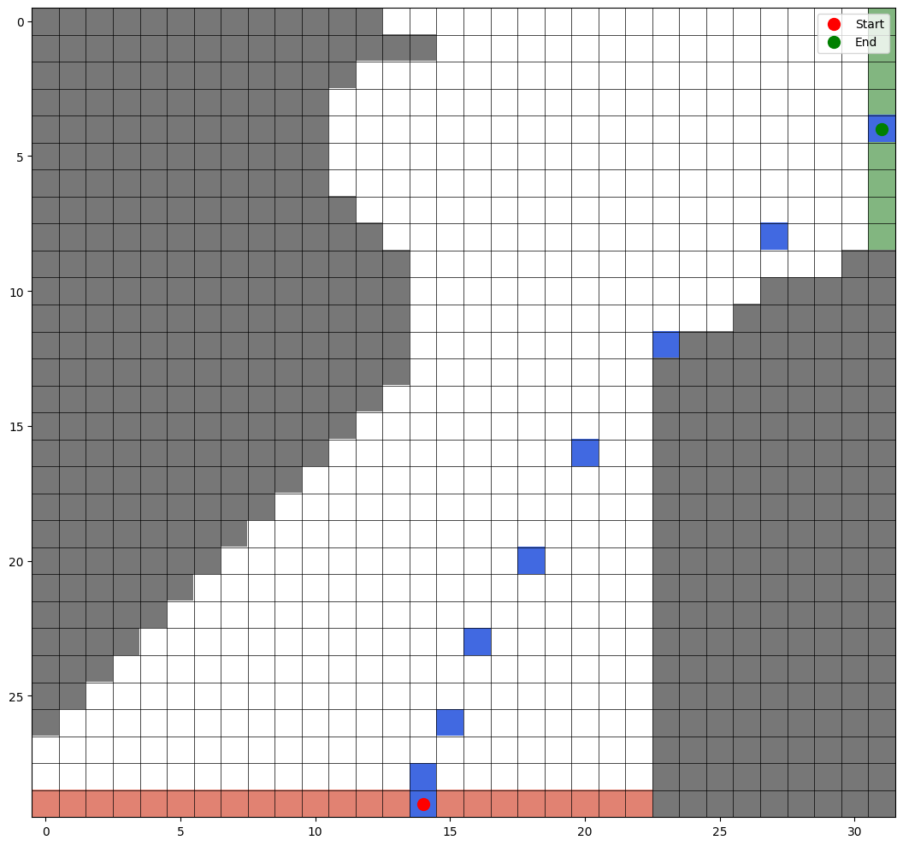

### Solution 5.1

#### Why the big jump in the last two rows at the rear (player sums 20–21)?

At sums of 20 and 21, the policy is to stick. The bust risk is gone, and we are already very close to 21, so the probability of winning is very high.

Before 20, the policy is to hit. Therefore, the bust risk is high, and the probability of winning is low.

#### Why does the far-left column of that back row drop (dealer showing Ace)?

When the dealer shows an Ace, the probability of the dealer's sum reaching 21 is a bit higher than if the dealer shows some other card. Therefore, our probability of winning is a bit lower.

#### Why are the frontmost values higher in the upper plots than the lower?

With a usable ace, we have more flexibility in moving to a strong hand since it can be used as a 1 or an 11. The expected value is therefore uniformly higher in the frontmost rows of the upper plots than the lower plots.

 

### Solution 5.2

In blackjack, a given state (defined by player sum, dealer's card, usable ace flag) usually appears at most once per episode. This is because upon each action, the player's sum either increases or the episode ends.

Because there are almost no repeated state visits within the same episode, first-visit and every-visit MC give the same results.

 

### Solution 5.3

For MC prediction of $q_\pi$, the backup is a full-episode backup: from the state-action pair $(s_t, a_t)$, you follow the policy $\pi$ all the way to termination, then backup the total return $G_t$ to $(s_t, a_t)$ (no bootstrapping).

 

### Solution 5.4

Instead of keeping all returns, we can keep

- $N(s, a)$: a count of how many times action $a$ was taken in state $s$

- $Q(s, a)$: the running average of returns

Then, when we see a new return $G_t$, we update incrementally:

$$
Q(s, a) \leftarrow Q(s, a) + \frac{1}{N(s, a)}\Big[G_t-Q(s,a)\Big]
$$

 

### Solution 5.5

The first-visit MC return is 10, whereas the every-visit MC return is the average of the returns from each visit:

$$
v_{EV}(s) = \frac{1 + \cdots + 10}{10} = 5.5
$$

 

### Solution 5.6

Firstly, we only include the time steps where action $a$ was taken in state $s$. Secondly, since the first action is restricted, we start our ratios from $t+1$ instead of $t$.

$$
Q(s, a) = \frac{\sum_{t \in \mathcal{T}(s, a)} \rho_{t+1:T(t)-1} \, G_t }{\sum_{t \in \mathcal{T}(s, a)} \rho_{t+1:T(t)-1}}
$$

 

### Solution 5.7

Weighted importance sampling is biased but the bias vanishes asymptotically as the number of episodes grows.

Early on, the denominator (sum of weights) is small and unstable, which can cause the ratio to fluctuate and push the estimate away from the true value. This explains the initial increase in mean square error (MSE). As more data accumulates, the denominator stabilizes, the bias shrinks, and the error decreases.

Ordinary importance sampling, on the other hand, is unbiased at every sample size but has high variance. Its MSE starts high due to this variance but decreases steadily with more episodes.

 

### Solution 5.8

For every-visit MC, the second moment of the importance sampling ratio is:

$$
\mathbb{E}\!\left[\sum_{t=0}^{T-1}\!\!\left(\prod_{u=t}^{T-1}\frac{\pi(A_u|S_u)}{b(A_u|S_u)}\right)^{\!2}\right]
$$

This is equal to:

$$
= \Big(\frac{1}{2} \cdot 0.1\Big) \Big(\frac{1}{0.5}\Big)^2
$$

$$
+ \Big(\frac{1}{2} \cdot 0.9 \cdot \frac{1}{2} \cdot 0.1\Big) \Big[\Big(\frac{1}{0.5}\Big)^2 + \Big(\frac{1}{0.5 \cdot 0.5}\Big)^2\Big]
$$

$$
+ \Big(\frac{1}{2} \cdot 0.9 \cdot \frac{1}{2} \cdot 0.9 \cdot \frac{1}{2} \cdot 0.1\Big) \Big[\Big(\frac{1}{0.5}\Big)^2 + \Big(\frac{1}{0.5 \cdot 0.5}\Big)^2 + \Big(\frac{1}{0.5 \cdot 0.5 \cdot 0.5}\Big)^2\Big]
$$

$$
+ \cdots
$$

This can be written as:

$$
0.1\sum_{k=0}^{\infty} (0.9)^k\,(0.5)^{k+1}\sum_{j=1}^{k+1} \left(\frac{1}{2}\right)^{2j}
$$

$$
= 0.1\sum_{k=0}^{\infty} (0.9)^k\,(0.5)^{k+1}\sum_{j=1}^{k+1} 4^j
$$

Since the summation on the right follows a geometric series, we can rewrite it as:

$$
\sum_{j=1}^{k+1} 4^j = \frac{4(4^{k+1} - 1)}{4 - 1} = \frac{4^{k+2} - 4}{3}
$$

So the expression becomes:

$$
0.1\sum_{k=0}^{\infty} (0.9)^k\,(0.5)^{k+1} \left(\frac{4^{k+2} - 4}{3}\right)
$$

$$
= \frac{0.1}{3} \, \sum_{k=0}^{\infty} (0.9)^k\,(0.5)^{k+1} \left(4^{k+2}\right) - \frac{0.1}{3} \, \sum_{k=0}^{\infty} (0.9)^k\,(0.5)^{k+1} \left(4\right)
$$

$$
= \frac{0.8}{3} \, \sum_{k=0}^{\infty} \left(1.8\right)^k - \frac{0.4}{3} \, \sum_{k=0}^{\infty} \left(0.45\right)^k = \infty
$$

The first term diverges while the second term converges. But since the first term diverges at a greater rate, the overall expression diverges.

Since the second moment of the importance sampling ratio is infinite, the variance of the every-visit MC estimator is also infinite.

 

### Solution 5.9

Instead of appending $G$ to $Returns(S_t)$, we keep a running total of the returns for each state.

- $N(s_t) \leftarrow N(s_t) + 1$
- $V(s_t) \leftarrow V(s_t) + \frac{1}{N(s_t)} \Big(G_t - V(s_t)\Big)$

Everything else remains the same.

 

### Solution 5.10

Let $C_n = \sum_{i=1}^{n} W_i$

Then, we can rewrite the equation as:

$$
V_{n+1} = \frac{\sum_{i=1}^{n} W_i G_i}{C_n}
$$

$$
= \frac{W_n G_n + \sum_{i=1}^{n - 1} W_i G_i}{C_n}
$$

$$
= \frac{W_n G_n + \Big(\sum_{i=1}^{n - 1} W_i\Big) V_n}{C_n}
$$

$$
= \frac{W_n G_n + \Big(\sum_{i=1}^{n} W_i\Big) V_n - W_n V_n}{C_n}
$$

$$
= V_n + \frac{W_n (G_n - V_n)}{C_n}
$$

 

### Solution 5.11

This is because in off-policy control, the target policy $\pi$ is kept deterministic and greedy.

If $A_t \neq \pi(S_t)$ then $\pi(A_t \mid S_t) = 0$ and we stop since the importance-sampling ratio beyond this point will be $0$.

Otherwise, $\pi(A_t \mid S_t) = 1$ and so the importance-sampling ratio will be

$$
\frac{\pi(A_t \mid S_t)}{b(A_t \mid S_t)} = \frac{1}{b(A_t \mid S_t)}
$$

 

### Solution 5.12

To solve this problem, I used an Off-policy Monte Carlo agent with an epsilon-greedy behavior policy and an initial value of -500 for each state. Additionally, I used exploring starts for the first half of the episodes to ensure that the agent explores the entire state space.

The value function for the first track is:

Sample trajectories for the first track:

  

The value function for the second track is:

Sample trajectories for the second track:

  

 

### Solution 5.13

The expectation in $\rho_{t:T-1} R_{t+1}$ can be written as:

$$
\mathbb{E}\!\left[\rho_{t:T-1} R_{t+1} \right] = \mathbb{E}\!\left[\frac{\pi(A_t \mid S_t)}{b(A_t \mid S_t)} \cdot \frac{\pi(A_{t+1} \mid S_{t+1})}{b(A_{t+1} \mid S_{t+1})} \cdot \cdots \cdot \frac{\pi(A_{T-1} \mid S_{T-1})}{b(A_{T-1} \mid S_{T-1})} \cdot R_{t+1} \right]
$$

We know that $R_{t+1}$ is the reward for taking action $A_t$ in state $S_t$ and following policy $\pi$ from that point onwards. This means that the reward $R_{t+1}$ and the actions taken after $t+1$ are independent.

Therefore, we can rewrite the expectation as:

$$
\mathbb{E}\!\left[\rho_{t:T-1} R_{t+1} \right] = \mathbb{E}\!\left[\frac{\pi(A_t \mid S_t)}{b(A_t \mid S_t)} \cdot R_{t+1} \right] \cdot \mathbb{E}\!\left[\frac{\pi(A_{t+1} \mid S_{t+1})}{b(A_{t+1} \mid S_{t+1})} \right] \cdot \cdots \cdot \mathbb{E}\!\left[\frac{\pi(A_{T-1} \mid S_{T-1})}{b(A_{T-1} \mid S_{T-1})} \right]
$$

And since we know that

$$
\mathbb{E}\!\left[ \frac{\pi(A_k \mid S_k)}{b(A_k \mid S_k)} \right]
= \sum_a b(a \mid S_k) \frac{\pi(a \mid S_k)}{b(a \mid S_k)}
= \sum_a \pi(a \mid S_k) = 1.
$$

The expectation will then become:

$$
\mathbb{E}\!\left[\rho_{t:T-1} R_{t+1} \right] = \mathbb{E}\!\left[\frac{\pi(A_t \mid S_t)}{b(A_t \mid S_t)} \cdot R_{t+1} \right] \cdot 1 \cdot \cdots \cdot 1 = \mathbb{E}\!\left[\frac{\pi(A_t \mid S_t)}{b(A_t \mid S_t)} \cdot R_{t+1} \right] = \mathbb{E}\!\left[\rho_{t:t} \, R_{t+1} \right]
$$

 

### Solution 5.14

The discounting-aware weighted importance-sampling estimator for action-value function is:

$$
Q(s,a) = \frac{\displaystyle \sum_{t \in \mathcal{T}(s,a)}
\left(
(1-\gamma) \sum_{h=t+1}^{T(t)-1} \gamma^{\,h-t-1}\;
\rho_{t+1:h}\;\bar{G}_{t:h}
\;+\;
\gamma^{\,T(t)-t-1}\;\rho_{t+1:T(t)}\;\bar{G}_{t:T(t)}
\right)}
{\displaystyle \sum_{t \in \mathcal{T}(s,a)}
\left(
(1-\gamma) \sum_{h=t+1}^{T(t)-1} \gamma^{\,h-t-1}\;\rho_{t+1:h}
\;+\;
\gamma^{\,T(t)-t-1}\;\rho_{t+1:T(t)}
\right)} \;
$$

_(Skipped for now)_
