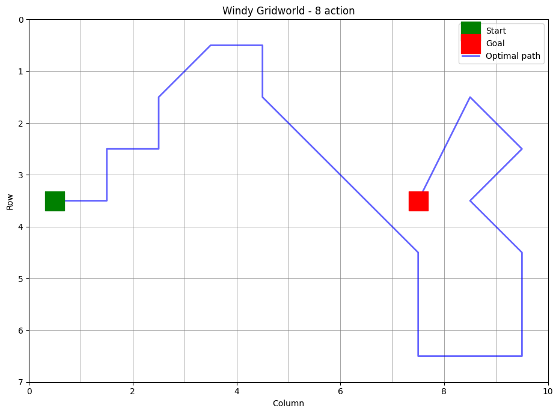

### Solution 6.1

$$
G_t - V_t(S_t) = \delta_t + \gamma \Big(G_{t+1} - V_t(S_{t+1})\Big)
$$

$$
= \delta_t + \gamma \Big(G_{t+1} - V_{t+1}(S_{t+1}) + V_{t+1}(S_{t+1}) - V_t(S_{t+1})\Big)
$$

Let $\Delta$ be the drift term between $V_t$ and $V_{t+1}$.

$$
\Delta_{t+1} = V_{t+1}(S_{t+1}) - V_t(S_{t+1})
$$

Then,

$$
G_t - V_t(S_t) = \delta_t + \gamma \Big(G_{t+1} - V_{t+1}(S_{t+1})\Big) + \gamma \, \Delta_{t+1}
$$

$$
= \delta_t + \gamma \Big[\delta_{t+1} + \gamma \Big(G_{t+2} - V_{t+2}(S_{t+2})\Big) + \gamma \, \Delta_{t+2}\Big] + \gamma \, \Delta_{t+1}
$$

$$
= \delta_t + \gamma \delta_{t+1} + \gamma^2 \Big(G_{t+2} - V_{t+2}(S_{t+2})\Big) + \gamma \, \Delta_{t+1} + \gamma^2 \, \Delta_{t+2}
$$

Unrolling the equation further, we get:

$$
= \Big(\delta_t + \gamma \delta_{t+1} + \gamma^2 \delta_{t+2} + \cdots
+ \gamma^{T-t-1} \delta_{T-1} \Big)
+ \Big(\gamma \, \Delta_{t+1} + \gamma^2 \, \Delta_{t+2} + \cdots + \gamma^{T-t} \, \Delta_{T}\Big)
$$

$$
= \sum_{k=t}^{T-1} \gamma^{k-t} \delta_k + \sum_{k=t+1}^{T} \gamma^{k-1} \Delta_k
$$

 

### Solution 6.2

In this scenario, where you move to a new building and parking lot but still join the highway at the same place, only the first part of the journey is unknown. The rest of the route is unchanged.

Monte Carlo must wait until many full trips finish to adjust the estimate for the new office.

TD, however, can immediately update the estimate for the new office by bootstrapping from the already accurate highway predictions. Because only the new office segment needs to be learned, TD adapts more quickly and is better in this case.

 

### Solution 6.3

The first episode went left: $C \rightarrow B \rightarrow A \rightarrow (\text{left terminal})$.

For $C \rightarrow B$, the TD error is:

$$
\delta_C = R + V(B) - V(C) = 0 + 0.5 - 0.5 = 0
$$

Similarly, for $B \rightarrow A$, the TD error is:

$$
\delta_B = R + V(A) - V(B) = 0 + 0.5 - 0.5 = 0
$$

For $A \rightarrow (\text{left terminal})$, the TD error is:

$$
\delta_A = R + V(\text{left terminal}) - V(A) = 0 + 0 - 0.5 = -0.5
$$

Therefore, after the first episode, only the estimate for state $A$ is updated by the following amount:

$$
\alpha \cdot \delta_A = 0.1 \cdot (-0.5) = -0.05
$$

The new estimate for state $A$ is:

$$
V(A) = V(A) + \alpha \cdot \delta_A = 0.5 - 0.05 = 0.45
$$

 

### Solution 6.4

As we can see from the plots, increasing $\alpha$ for Monte Carlo makes the estimates more volatile, because MC’s updates rely on full returns with high variance. This forces MC to use a small $\alpha$ to remain stable, which slows learning.

TD, by contrast, bootstraps from existing estimates, giving it lower variance and allowing larger $\alpha$ values without instability.

Exploring a wider range of $\alpha$ values would not overturn the conclusion: TD(0) would still consistently achieve lower RMS error than MC.

Each algorithm’s best constant $\alpha$ is already close to what’s shown (≈0.1 for TD, ≈0.02–0.04 for MC). A slightly different $\alpha$ might improve results marginally, but there is no single fixed $\alpha$ that would make MC significantly better than TD.

To outperform what’s shown, one would need a decreasing step-size schedule rather than just changing $\alpha$. This is because early episodes benefit from larger $\alpha$, while later episodes benefit from smaller $\alpha$.

 

### Solution 6.5

Since all states are initialized to $0.5$, the center state $C$ is exactly correct at the start. However, because TD bootstraps from its neighbors, $V(C)$ is pushed away from $0.5$. At the same time, the other states $(A, B, D, E)$ are pulled towards their true values, causing the RMS error to decrease initially. But once $V(C)$ is pulled away from $0.5$, the RMS error goes up again. This problem is exacerbated with high values of $\alpha$ because the updates are more aggressive.

This issue is not inherent to TD itself but is largely due to the choice of initial values. With different initializations, the problem could be avoided.

 

### Solution 6.6

#### 1) Using Bellman Equations

Let the terminal on the left have value $0$ and the one on the right value $1$. For the five non-terminal states, the Bellman equations for the Markov Reward Process are:

$$
v(A) = \frac{1}{2} \, v(B)
$$

$$
v(B) = \frac{1}{2} \, v(A) + \frac{1}{2} \, v(C)
$$

$$
v(C) = \frac{1}{2} \, v(B) + \frac{1}{2} \, v(D)
$$

$$
v(D) = \frac{1}{2} \, v(C) + \frac{1}{2} \, v(E)
$$

$$
v(E) = \frac{1}{2} \, v(D) + \frac{1}{2}(1) = \frac{1}{2} \, v(D) + 0.5
$$

We get a linear system of equations with 5 equations and 5 unknowns that can be solved using linear algebra.

#### 2) Using Hitting Probability

We can calculate the probability of hitting the right terminal before hitting the left terminal from each state.

This can simply be calculated by looking at the difference in path lengths from the current state to the right terminal and the left terminal.

For example, for state $B$, the path length to the left terminal is 2 and the path length to the right terminal is 4. Therefore, the probability of hitting the right terminal before hitting the left terminal is $\frac{4}{6}$.

#### Which method did the book likely use?

Most likely the hitting-probability method, because it is exact, simple, and yields the clean fractions $i/6$ without solving a system or running simulations.

 

### Solution 6.7

When data comes from behavior policy $b$, the only mismatch with $\pi$ at time $t$ is the distribution of the action $A_t$. The action determines both the immediate reward and the next state. So we correct it with a one-step ratio:

$$
\rho_t = \frac{\pi(A_t \mid S_t)}{b(A_t \mid S_t)}
$$

and multiply the TD target by this ratio:

$$
V(S_t) \leftarrow V(S_t) + \alpha \left[\rho_t \Big(R_{t+1} + \gamma \, V(S_{t+1})\Big) - V(S_t)\right]
$$

 

### Solution 6.8

$$
G_t - Q(S_t, A_t) = R_{t+1} + \gamma \, G_{t+1} - Q(S_t, A_t)
$$

$$
= \Big[R_{t+1} + \gamma \, Q(S_{t+1}, A_{t+1}) - Q(S_t, A_t)\Big] + \gamma \Big[G_{t+1} - Q(S_{t+1}, A_{t+1})\Big]
$$

$$
= \delta_t + \gamma \Big[G_{t+1} - Q(S_{t+1}, A_{t+1})\Big]
$$

$$
= \delta_t + \gamma \Big[\delta_{t+1} + \gamma \Big[G_{t+2} - Q(S_{t+2}, A_{t+2})\Big]\Big]
$$

$$
= \delta_t + \gamma \, \delta_{t+1} + \gamma^2 \Big[G_{t+2} - Q(S_{t+2}, A_{t+2})\Big]
$$

$$
= \delta_t + \gamma \, \delta_{t+1} + \gamma^2 \, \delta_{t+2} + \cdots + \gamma^{T-t-1} \, \delta_{T-1}
$$

Hence,

$$
G_t - Q(S_t, A_t) = \sum_{k=t}^{T-1} \gamma^{k-t} \delta_k
$$

 

### Solution 6.9

With 4 actions, the optimal path length is 16. Adding diagonal moves (8 actions) reduces it to 7, and including a “no-op” action (9 actions) also yields 7.

The learning curve shows that the 9-action agent starts slower but eventually matches the efficiency of the 8-action agent, both clearly outperforming the 4-action case.

### Solution 6.10

Under stochastic wind, optimal paths become longer: 21 steps with 8 actions and 18 with 9 actions.

Convergence is similar across both, but the 9-action agent improves late in training and finds shorter paths than the 8-action agent.

 

### Solution 6.11

In Q-learning, the agent may follow an $\epsilon$-greedy policy (or any exploratory policy) to generate actions (this is the behavior policy $b$).

The update, however, uses $\max_a Q(S_{t+1}, a)$ as the target (greedy policy $\pi$).

Since the behavior policy and the target policy are different, Q-learning is an off-policy algorithm.

 

### Solution 6.12

If the action selection is greedy, the update rules for SARSA are reduced to:

$$
Q(S_t, A_t) \leftarrow Q(S_t, A_t) + \alpha \Big[R_{t+1} + \gamma \, \max_a \, Q(S_{t+1}, a) - Q(S_t, A_t)\Big]
$$

which is exactly the same as the update rule for Q-learning.

However, the algorithms are not operationally identical because in SARSA, the next action $A_{t+1}$ is chosen before the update, based on the old $Q$-values. That action is then carried forward into the next step.

Whereas in Q-learning, the next action $A_{t+1}$ is chosen after the update, based on the updated $Q$-values.

So, while the update equations coincide under greedy policies, the sequence of state–action pairs the agent actually follows can differ, since SARSA commits to the old greedy action and Q-learning commits to the new one.

 

### Solution 6.13

For Double Expected SARSA, we have two action-value functions $Q_1$ and $Q_2$, and randomly choose which one to update at each step (same as Double Q-learning).

With $0.5$ probability:

$$
Q_1(S, A) \leftarrow Q_1(S, A) + \alpha \Big[R + \gamma \, \Big[\sum_a \pi_\epsilon^1(a \mid S') \cdot Q_2(S', a)\Big] - Q_1(S, A)\Big]
$$

else

$$
Q_2(S, A) \leftarrow Q_2(S, A) + \alpha \Big[R + \gamma \, \Big[\sum_a \pi_\epsilon^2(a \mid S') \cdot Q_1(S', a)\Big] - Q_2(S, A)\Big]
$$

where $\pi_\epsilon^1$ is the $\epsilon$-greedy policy for $Q_1$ such that:

$$
\pi_\epsilon^1(a \mid S) = \begin{cases}
1 - \epsilon + \frac{\epsilon}{| \mathcal{A} |} & \text{if } a = \argmax_a Q_1(S, a) \\[8pt]
\frac{\epsilon}{| \mathcal{A} |} & \text{otherwise}
\end{cases}
$$

and $\pi_\epsilon^2$ is the $\epsilon$-greedy policy for $Q_2$.

Note that for the update of $Q_1$, we use the expected value of $Q_2$ under the $\epsilon$-greedy policy for $Q_1$. The converse is true for the update of $Q_2$.

 

### Solution 6.14

In the Car Rental problem, the next state after moving cars is known. For example, if Jack has 5 cars at location 1 and 2 at location 2, and he moves 1 car from location 1 to location 2, the resulting state is $(4, 3)$.

Similarly, if he starts with 6 cars at location 1 and 1 at location 2 and moves 2 cars, the resulting state is also $(4, 3)$.

In the standard formulation, these two state–action pairs are evaluated separately, even though they lead to the same outcome.

By instead working with afterstates, we can collapse both cases into a single representation. This reduces the number of states that need to be evaluated, which in turn will speed up convergence.
